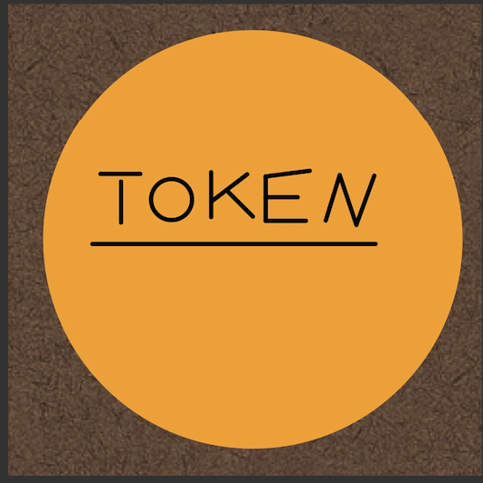
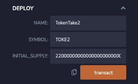
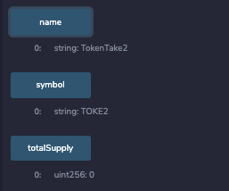
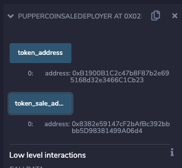
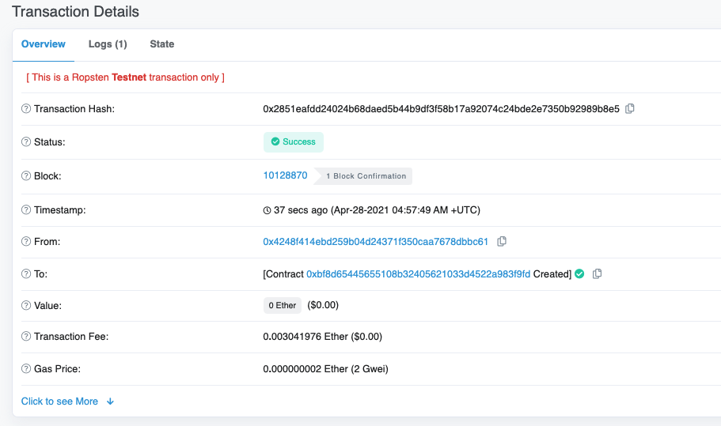
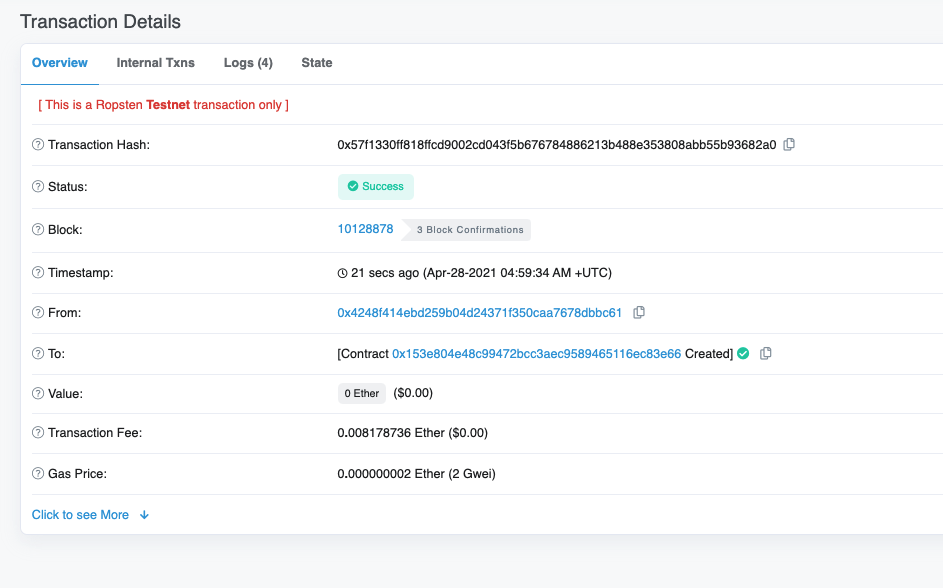
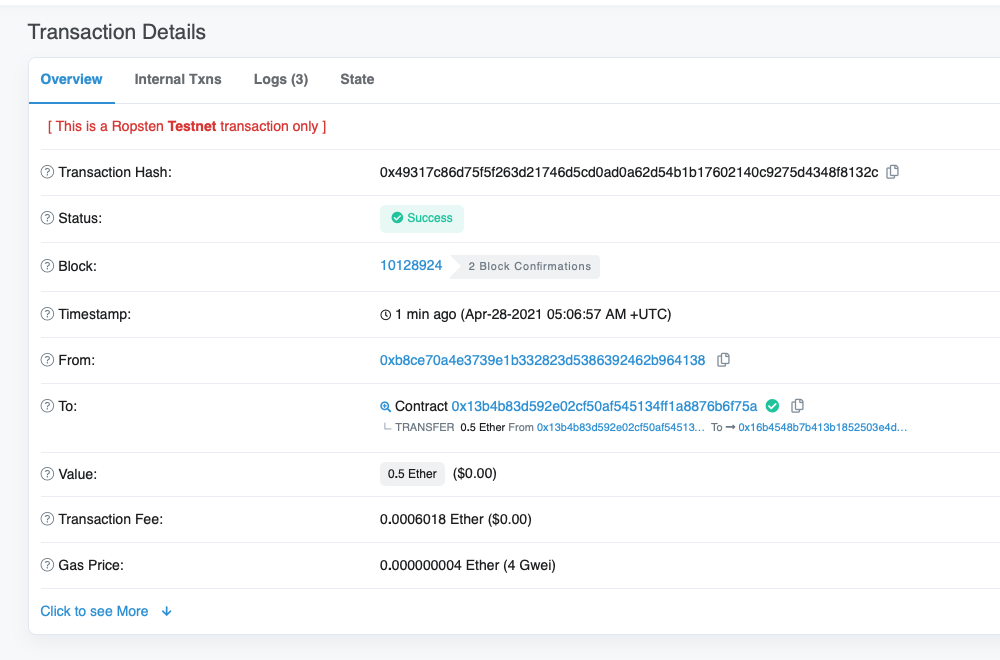
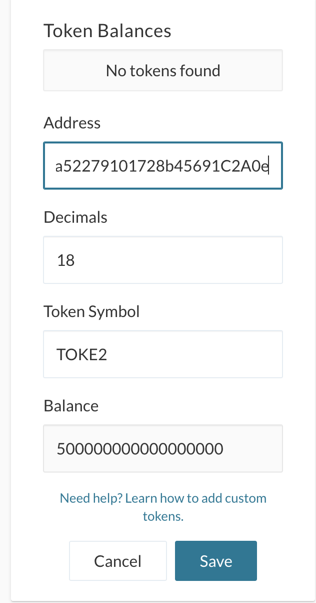
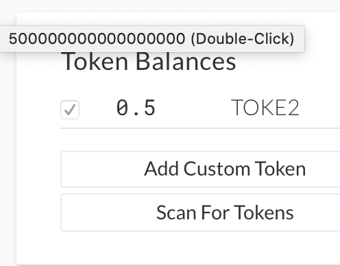

# Crowdselling Some Tokens 

## Create the Token: 
Using the ERC20Mintable Standard, I have created a contract to create a Token. Throughout I have named it **TOKE2**. 

### Token Addresses
From the `Puppercoinsaledepoloyer`, we get:

## Deployment and Use with MyCrypto.. 
**TOKE2** created on Ropsten Testnet: 

**TOKE2** sale to Ropsten Testnet : 

### Send Money to Contract for Tokens 

Add the tokens: 

Check the balance: 

